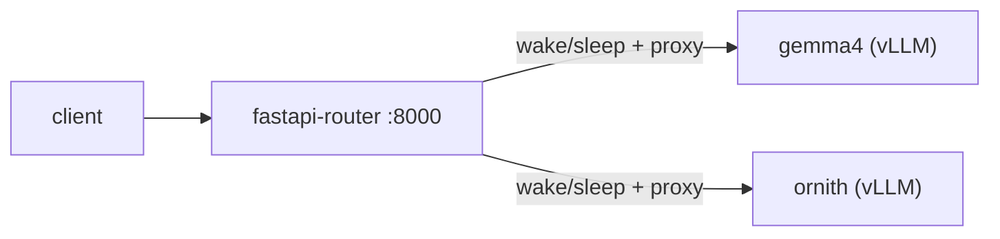

# serve

vLLM model serving stack for a single-GPU box (DGX Spark / GB10, ~121.63GiB
unified CPU+GPU memory) that can't hold more than one large model resident at
once. A FastAPI router puts vLLM engines to sleep/wake on demand so several
"served" models can share the one GPU, fronted by a single OpenAI-compatible
endpoint.

## Architecture



- **gemma4** / **ornith** — vLLM OpenAI-compatible servers, each launched with
  `--enable-sleep-mode`. Only one is ever awake on the GPU at a time.
- **fastapi-router** (`router/`) — OpenAI-compatible proxy (FastAPI + LiteLLM)
  on port 8000. Before dispatching a request it calls `SwapManager`, which
  sleeps the currently-awake engine and wakes the target one if they differ,
  then serializes concurrent access per model via inflight counters so a busy
  engine is never swapped out from under in-flight requests. See
  `router/app/swap_manager.py` for the exact wake/sleep sequence and
  `router/app/config.py` for the served-model registry.
- **healthcheck.py** — shared Docker `HEALTHCHECK` for both vLLM services.
  Reports healthy once `/health` responds; on its first successful check it
  puts the model to sleep (level 2) so `depends_on: condition: service_healthy`
  lets the next service in the boot chain start loading without two models'
  memory coexisting on the shared GPU. After that one-time transition it never
  calls `/sleep` again — steady-state wake/sleep is owned exclusively by the
  router's `SwapManager`.

`ornith`'s underlying model is overridable via the `MODEL` env var (defaults
to `deepreinforce-ai/Ornith-1.0-35B-FP8`).

All compose services (here and in `qwen36/`) use the shared `x-logging`
anchor (`json-file`, 10MB × 3 files) so container logs can't grow
unboundedly; `nemotron-3-super.sh` applies the same cap via `--log-opt`
since it runs outside compose.

## Running

```bash
docker compose up -d
```

Requires the NVIDIA Container Toolkit and a Hugging Face cache at
`~/.cache/huggingface` (run `huggingface-cli login` first for gated models
like Gemma).

Exposed API (port 8000, OpenAI-compatible):

- `GET /health`
- `GET /v1/models`
- `POST /v1/chat/completions`
- `POST /v1/completions`

`model` in the request body must be one of the keys in
`router/app/config.py::MODELS` (currently `gemma4`, `Ornith-1.0`).

## qwen36/docker-compose.yml

Standalone compose stack for Qwen 3.6-35B-A3B, deliberately kept **out** of
the top-level `docker-compose.yml` and in its own directory so it gets an
isolated compose project (`qwen36`) and network instead of joining the main
`vllm` project. Two mutually-exclusive profiles select between weight
formats (same container name/port, so only one runs at a time):

```bash
cd qwen36
docker compose --profile fp8 up -d      # Qwen/Qwen3.6-35B-A3B-FP8
docker compose --profile nvfp4 up -d    # nvidia/Qwen3.6-35B-A3B-NVFP4
```

To iterate on settings, edit the `command:` list for the active profile and
re-run the same `up -d` — compose recreates the container in place instead of
requiring a manual `docker rm -f` first.

## nemotron-3-super.sh

Standalone launcher for `nvidia/NVIDIA-Nemotron-3-Super-120B-A12B-NVFP4`,
deliberately kept **out** of `docker-compose.yml`: its NVFP4 MoE marlin
weight-repack step peaks at ~108GiB GPU memory, which doesn't leave enough
margin against this box's 121.63GiB total once any sibling vLLM engine is
resident — even just asleep. It needs the entire GPU/unified memory pool to
itself. See the comments in the script for the full rationale and run steps
(`docker compose down` first, then `HF_TOKEN=... ./nemotron-3-super.sh`).

It uses `super_v3_reasoning_parser.py`, a custom vLLM reasoning-parser plugin
that fixes how the stock `deepseek_r1` parser (which Nemotron 3 reuses)
handles thinking-disabled requests and truncated-reasoning edge cases, so
final content isn't dropped into `reasoning_content` when it shouldn't be.

## Layout

```
docker-compose.yml            gemma4 + ornith + fastapi-router stack
healthcheck.py                 shared vLLM sleep-mode healthcheck
qwen36/docker-compose.yml       standalone Qwen 3.6-35B-A3B stack (fp8/nvfp4 profiles)
nemotron-3-super.sh             standalone Nemotron 3 Super launcher
super_v3_reasoning_parser.py    reasoning parser plugin for Nemotron 3
router/                        FastAPI OpenAI-compatible swap-aware proxy
  app/main.py                    routes + request dispatch
  app/config.py                  served-model registry
  app/swap_manager.py            sleep/wake orchestration
```
